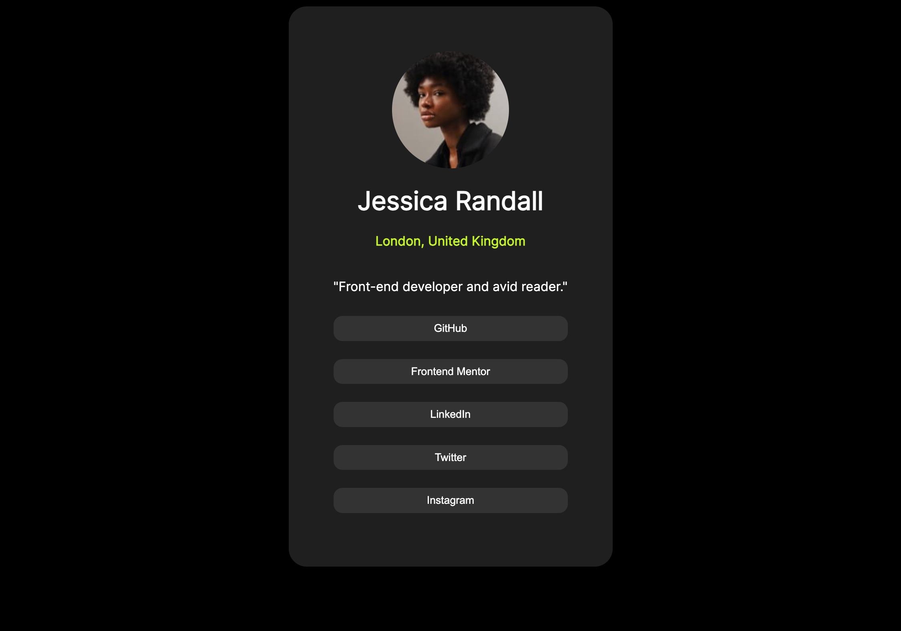

# Frontend Mentor - Social links profile solution

This is a solution to the [Social links profile challenge on Frontend Mentor](https://www.frontendmentor.io/challenges/social-links-profile-UG32l9m6dQ). Frontend Mentor challenges help you improve your coding skills by building realistic projects. 

## Table of contents

- [Overview](#overview)
  - [Note](#note)
  - [Screenshot](#screenshot)
  - [Links](#links)
- [My process](#my-process)
  - [Built with](#built-with)
  - [What I learned](#what-i-learned)
  - [Continued development](#continued-development)
- [Author](#author)

**Note: Delete this note and update the table of contents based on what sections you keep.**

## Overview

### Note

I have not added any of social links for security reasons.

### Screenshot

### Links

- Solution URL: [Social Link repo](https://github.com/theHalfBloodStackMaster/social-links-profile-challange)
- Live Site URL: [Social Link Web Page](https://thehalfbloodstackmaster.github.io/social-links-profile-challange/)

## My process

### Built with

- Semantic HTML5 markup
- CSS custom properties
- Flexbox

### What I learned

### Continued development

In next project I would like to use javascript.

## Author

- Frontend Mentor - [@theHalfBloodStackMaster](https://www.frontendmentor.io/profile/theHalfBloodStackMaster)